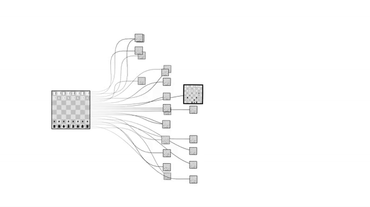
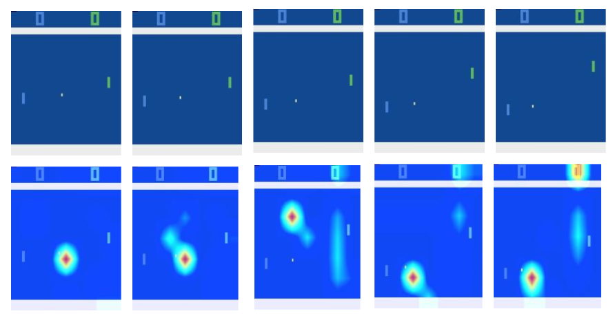
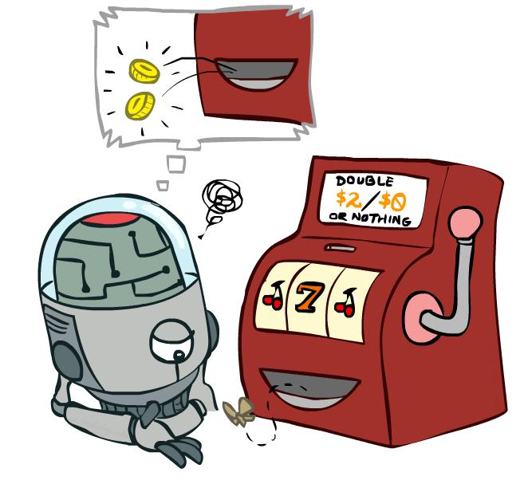
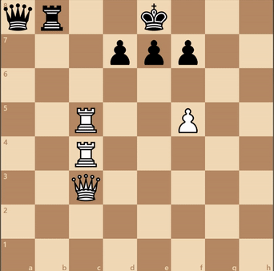
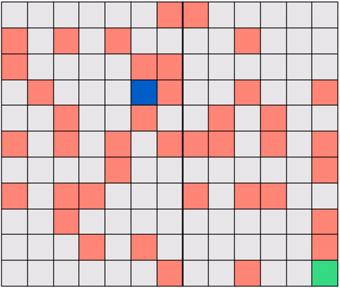
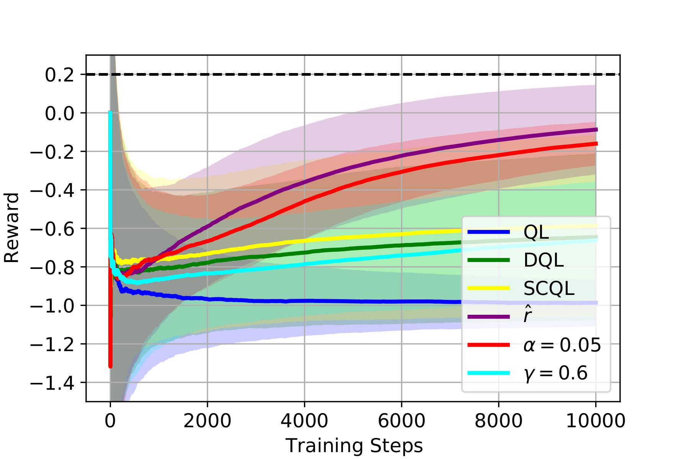
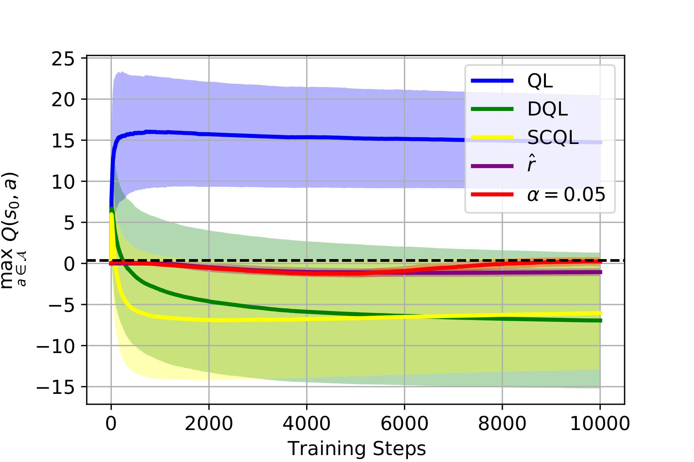
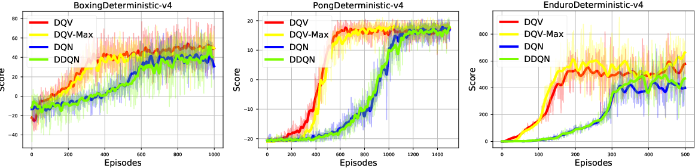
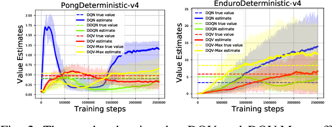

class: title-slide
count: false

# Topics in AI

Credit Assignment for Interpretable Reinforcement Learning

  

**Dr. Matthia Sabatelli** 
[m.sabatelli@rug.nl](mailto:m.sabatelli@rug.nl)
---

# Outline

- Brief Introduction
- (Deep) Reinforcement Learning
- Research Directions
    - The Credit Assignment Problem
    - Interpretability Gains

---

# Introduction

- *2010-2013*: BSc. Computer Science from the University of Trento
- *2014-2017*: MSc. Artificial Intelligence from the University of Groningen
- *2017-2021*: Ph.D. Electrical Engineering and Computer Science from the University of Liege
- *2021-2022*: Lecturer at the Bernoulli Institute
- *2022 - present*: Assistant Professor in Reinforcement Learning (still) at the Bernoulli Institute

---

# Introduction

I am part of the [Autonomous Perceptive Systems](https://www.rug.nl/research/bernoulli/groups/autonomous-perceptive-systems/?lang=en) lab, the group which within the Bernoulli Institute does research in machine learning.

Starting from this year, we also have a more specific webpage, dedicated to the [RL Research Group](https://sites.google.com/rug.nl/rlresearchgroup/people?authuser=0). Here you can find information about:
- Latest published research
- BSc. and MSc. thesis topics
- RL Cafe
- Potential job openings

---

# Introduction

If I look familiar to you that means that you might have followed:

- Reinforcement Learning Practical (WBAI015-05)
- Deep Learning (WMAI017-05)
- Deep Reinforcement Learning (WMAI024-05)

You might have also done a BSc. project under my supervision.

---

# (Deep) Reinforcement Learning

	
Deep Reinforcement Learning (DRL) is an emerging field of artificial intelligence that combines *Deep Learning* and *Reinforcement Learning* to create intelligent agents capable of learning through trial and error.

This successfull combination allows us to design artificial agents that:
- Can act when the environment has a continuous state/action space 
- Are able to generalize across different environments
- Can overcome some severe computational/memory limitations that are typical of tabular RL

---
# (Deep) Reinforcement Learning

---

# (Deep) Reinforcement Learning

---

# (Deep) Reinforcement Learning

For example in the game of Pong

- All states look very similar among each other
- Small portions of the state-space are actually informative
- Despite some pre-processing operations the state-space stays highly-dimensional

---

# (Deep) Reinforcement Learning

In Deep Reinforcement Learning we have a *neural network* that is trained such that it can possibly learn:
- A Value-Function 
- A Policy 
- A Model of the Reinforcement Learning Environment

If the first two are learned we are talking about *model-free* Reinforcement Learning, while if the latter is learned we are talking about *model-based* Reinforcement Learning.

In all cases we learn **via interaction** by gathering *trajectories* $\tau = \langle s\_t, a\_t, r\_t, s\_{t+1}\rangle$

---

# (Deep) Reinforcement Learning

When we are learning a *value function* we are trying to learn how good/bad it is to take a certain action in a certain state:

$$
\begin{aligned}
    Q^{\pi}(s,a)=\mathbb{E}\bigg[\sum\_{k=0}^{\infty}\gamma^{k}r_{t+k} \bigg| s\_t = s, a\_t=a, \pi\bigg].
\end{aligned}
$$

---

# (Deep) Reinforcement Learning

When we are learning a *policy* we are trying to learn a map from states to actions $\pi: \mathcal{S} \rightarrow \mathcal{A}$ that maximizes a certain criterion $J$

$$
\begin{aligned}
    J(\mathbf{\theta}) \coloneqq \mathbb{E}\_{\tau \sim p\_{\theta}(\tau)} \Bigg[ \sum\_{t=1}^T r(s\_t, a\_t) \bigg]. 
\end{aligned}
$$

---
# (Deep) Reinforcement Learning

When we are learning the *model* of the environment we are trying to learn the underlying dynamics of the problem we would like to solve:

- $\mathcal{P}:\mathcal{S}\times\mathcal{A}\times\mathcal{S}\rightarrow [0,1]$ is the transition function
- $\Re:\mathcal{S}\times\mathcal{A}\times\mathcal{S}\rightarrow \mathbb{R}$ is the reward function returning $r_t$

---

## The Credit Assignment Problem

Is a fundamental research question in Reinforcement Learning and Artificial Intelligence

- It consists in determining which *states* and *actions* are the ones responsible for a certain **outcome** when an agent interacts with its environment.

- It is a critical issue in Reinforcement Learning as the *reward* signal $r\_t$ received by the agent might be **delayed** and therefore not attributable to a single action.

---

## The Credit Assignment Problem

Sparse Reward Environments

---

## The Credit Assignment Problem

Which of these moves deserves the most credit?

---

## The Credit Assignment Problem

Which of these moves deserves the most credit?

There are two typical *answers* to this question:
- Every move in the sequence plays an **equal role** with respect to the final checkmate
- The **last move** is the one that deserves the most credit as it is the one that officially ends the game and therefore yields $r\_t$

---

## The Credit Assignment Problem

One way to *mathematically* incorporate this perspective into the model-free Reinforcement Learning loop is given by:
- Monte-Carlo (MC) Learning
- Temporal Difference (TD) Learning

Let us recall that our **goal** is that of learning the following quantity:

$$
\begin{aligned}
    Q^{\pi}(s,a)=\mathbb{E}\bigg[\sum\_{k=0}^{\infty}\gamma^{k}r_{t+k} \bigg| s\_t = s, a\_t=a, \pi\bigg].
\end{aligned}
$$

---

## The Credit Assignment Problem

- If we do this via a Monte-Carlo (MC) Learning approach we would use a learning rule which comes in the following form:

$$
\begin{aligned}
    Q(s,a) \leftarrow Q(s,a) + \alpha \cdot (G - Q(s,a)).
\end{aligned}
$$

> Where $G=\sum\_{k=0}^{\infty} \gamma^{k} r\_{t+k}$ 

- Whereas if we would use a Temporal-Difference (TD) based approach, one possible learning rule could look like: 

$$
\begin{aligned}
    Q(s,a) \leftarrow Q(s,a) + \alpha \cdot (r\_t + \gamma \cdot Q(s^{\prime}, a^{\prime}) - Q(s,a)).
\end{aligned}
$$

---

class: end-slide, center
count: false

Why??? 

---
## The Credit Assignment Problem

The estimated $Q(s,a)$ allow the agent to derive an optimal policy:

$$
\begin{aligned}
	\pi^{\star}(s) = \underset{a\in\mathcal{A}}{\text{argmax}} \ Q^{\star}(s,a) \ \text{for all} \ s \in \mathcal{S}.
\end{aligned}
$$

Where $\pi: \mathcal{S} \rightarrow \mathcal{A}.$ 

Intuitively we can see a model-free Reinforcement Learning agent going through the following steps:
- At first it has **no** knowledge about how good/bad different $Q(s,a)$ are
- While interacting with the environment it learns $Q(s,a)$ by addressing the credit assignment problem
- It finally derives policy $\pi$ from $Q(s,a)$

---

## The Credit Assignment Problem

- The $Q(s,a)$ values contain **very powerful** information when it comes to understanding the behaviour of a Reinforcement Learning agent

- The agent behaves in such a way because it thinks (**expects**) it is going to get a certain amount of reward if a certain action is performed

This is extremely *relevant* in nowaday's AI landscape where it has become crucial to think about what makes certain machine learning models make certain predictions!

---
## The Credit Assignment Problem

---

## The Credit Assignment Problem

Note that if we do not address the Credit Assignment problem in Reinforcement Learning, we are not able to get (almost) any intuition into the *behaviour* of an agent.

- Policy Search algorithms: 
    - $ J(\mathbf{\theta}) \coloneqq \mathbb{E}\_{\tau \sim p\_{\theta}(\tau)} \Bigg[ \sum\_{t=1}^T r(s\_t, a\_t) \bigg]$

- Model-Based algorithms:
    - $\mathcal{P}:\mathcal{S}\times\mathcal{A}\times\mathcal{S}\rightarrow [0,1]$ 
    - $\Re:\mathcal{S}\times\mathcal{A}\times\mathcal{S}\rightarrow \mathbb{R}$ 

---

## Interpretability Gains 

One of the most popular model-free Reinforcement Learning algorithms is **Q-Learning**.

Its goal is to update each visited state-action pair with the following rule:

$$
\begin{aligned}
Q(s\_t,a\_t):=Q(s\_t,a\_t) + \alpha\big[r\_t + \gamma \:\underset{a\in \mathcal{A}}{\max} Q(s\_{t+1},a) - Q(s\_t, a\_t) \big].
\end{aligned}
$$

- Converges (in the limit) to the optimal $Q^{\star}(s,a)$ with probability 1
- As long as each state-action pair is visited infinitely many times

$$
\begin{aligned}
\sum_{t=0}^{\infty} \alpha\_t(s,a) = \infty
\end{aligned}
$$

$$
\begin{aligned}
\sum_{t=0}^{\infty} \alpha^{2}\_t(s,a) = \infty
\end{aligned}
$$

---
## Interpretability Gains 

Despite such theoretical guarantees, the RL community started to notice that in some cases Q-Learning performed **very poorly**.

This was particularly the case in RL environments with sources of *randomness*:
- Stochastic Rewards
- Stochastic Transitions
- Exploration Strategies

---

## Interpretability Gains 

---

## Interpretability Gains 

.footnote[Wagenbach, Julius, and Matthia Sabatelli. "Factors of Influence of the Overestimation Bias of Q-Learning."]

---
## Interpretability Gains 

.footnote[Wagenbach, Julius, and Matthia Sabatelli. "Factors of Influence of the Overestimation Bias of Q-Learning."]

---
## Interpretability Gains 

.footnote[Sabatelli, M., Louppe, G., Geurts, P., & Wiering, M. A. (2020, July). The deep quality-value family of deep reinforcement learning algorithms. In 2020 International Joint Conference on Neural Networks (IJCNN) (pp. 1-8). IEEE.]

---
# Summary
---

# Summary

- There are three possible ways of solving Reinforcement Learning problems

---
# Summary

- There are three possible ways of solving Reinforcement Learning problems
- Tackling the Credit Assignment problem allows us to gain insights into the *what* and the *why* that drive the decisions of an autonomous agent

---

# Summary

- There are three possible ways of solving Reinforcement Learning problems
- Tackling the Credit Assignment problem allows us to gain insights into the *what* and the *why* that drive the decisions of an autonomous agent
- This can be done by adopting a model-free learning perspective

---

# Summary

- There are three possible ways of solving Reinforcement Learning problems
- Tackling the Credit Assignment problem allows us to gain insights into the *what* and the *why* that drive the decisions of an autonomous agent
- This can be done by adopting a model-free learning perspective
- This allows us to identify biases in algorithms and create more robust methods

---

class: end-slide, center
count: false

See you next semester!
